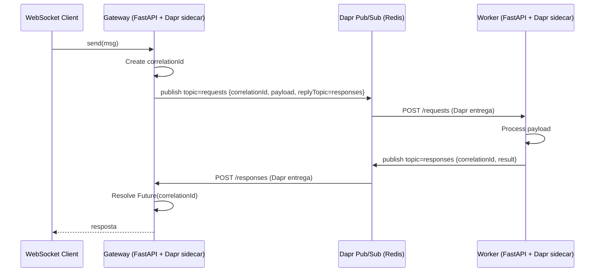
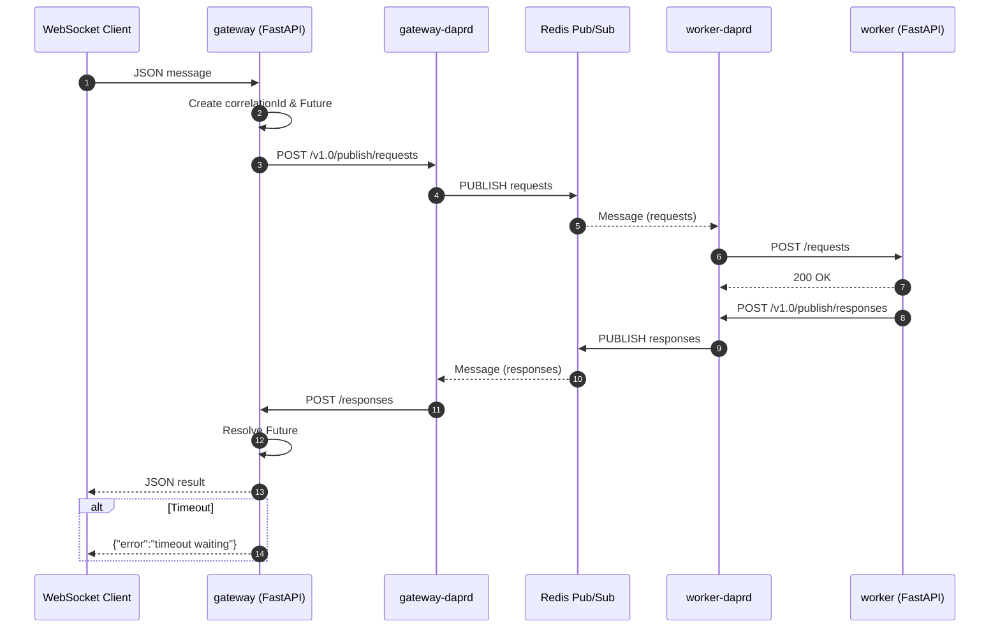

# Dapr Request-Reply over Redis (WebSocket Gateway)

Este projeto demonstra um padrão de request-reply usando **Dapr Pub/Sub (Redis)** entre dois serviços FastAPI:

* `gateway`: expõe um endpoint **WebSocket** (`/ws`) para clientes externos. Cada mensagem recebida gera um publish em um tópico Redis através do sidecar Dapr.
* `worker`: consome mensagens do tópico, processa a carga e envia a resposta em outro tópico de reply.

O `gateway` correlaciona a resposta usando um `correlationId` interno e envia o resultado de volta ao cliente WebSocket. Observabilidade é fornecida via **Prometheus** (métricas), **Jaeger** (traces OTEL emitidos pelos sidecars) e **OpenTelemetry Collector** (pipeline central).

## Estrutura do projeto

```
.
├── docker-compose.yml           # Orchestrates services, sidecars, and observability stack
├── dapr/                        # Dapr configuration (tracing, access control)
├── services/
│   ├── gateway/                 # FastAPI + WebSocket; publica em 'requests' e aguarda 'responses'
│   └── worker/                  # FastAPI; consome 'requests' e publica em 'responses'
├── otel/collector.yaml          # OpenTelemetry Collector pipeline feeding Jaeger & Prometheus
└── observability/prometheus.yml # Prometheus scrape configuration for Dapr sidecars
```

## Pré-requisitos

- Docker and Docker Compose v2+
- Optional: `curl` or a similar HTTP client for testing requests

## Executando localmente

1. Build and start the stack:
   ```bash
   docker compose up --build
   ```
2. Wait until the FastAPI apps and their Dapr sidecars report as healthy in the logs.
3. Run sample requests (see below) to exercise the Redis-backed request-response flow.

To stop the stack, press `Ctrl+C` and optionally remove containers with `docker compose down`.

## Serviços e portas

| Componente                 | Endpoint / Porta                 | Observação |
|--------------------------- |----------------------------------|------------|
| Sidecar Dapr (gateway)     | `http://localhost:3500`          | Porta HTTP do sidecar (publish, invoke, healthz) |
| Sidecar Dapr (worker)      | `http://localhost:3502`          | Porta HTTP do sidecar do worker |
| App Gateway (FastAPI)      | `ws://localhost:8081/ws`         | WebSocket exposto (host 8081 -> container 8080) |
| App Worker (FastAPI)       | (rede interna docker)            | Não exposto direto; só via sidecar |
| Redis                      | `redis://localhost:6379`         | Broker Pub/Sub (component `messagebus`) |
| Prometheus UI              | `http://localhost:9090`          | Consulta de métricas |
| Jaeger UI                  | `http://localhost:16686`         | Visualização de traces |
| OTEL Collector (spanmetrics)| `http://localhost:8889/metrics` | Métricas agregadas de spans |

Métricas dos apps FastAPI: `/metrics` diretamente em `gateway:8080` e `worker:8080` (Prometheus coleta via rede interna) + métricas dos sidecars nas portas 9092 (gateway) e 9091 (worker).

## Fluxo (Sequence Diagram)
Below are two sequence diagrams illustrating the request-reply flow in this project. The first provides a simplified view, highlighting only the main participants and steps in the process. The second offers a more detailed flow, including the interactions between Dapr sidecars, Redis topics, and timeout handling, enabling a more comprehensive understanding of the architecture and involved components.

#### Simplified Diagram


#### Derailed Diagram



## Exemplos

### Health

```bash
curl http://localhost:3500/v1.0/healthz              # Sidecar gateway
curl http://localhost:3502/v1.0/healthz              # Sidecar worker
curl http://localhost:3500/v1.0/invoke/gateway/method/health
curl http://localhost:3502/v1.0/invoke/worker/method/health
```

### Métricas

Direto (rede interna docker):
```
http://gateway:8080/metrics
http://worker:8080/metrics
```
Via Prometheus UI: `http://localhost:9090`.

### WebSocket (request-reply)

Abra uma sessão e envie mensagens JSON:
```bash
npx wscat -c ws://localhost:8081/ws
> {"hello": "Something"}
< {"ok": true, "echo": {"hello": "Something"}, "processedBy": "worker-1"}
```

Cada mensagem gera:
1. Publish em `requests`.
2. Processamento no `worker`.
3. Publish de volta em `responses`.
4. Entrega ao `gateway` e envio ao cliente WebSocket.

Campos internos usados:
* `correlationId`: correlaciona request-reply no gateway.
* `replyTopic`: indica o tópico de resposta (`responses`).

### Pub/Sub Subscription Discovery

O Dapr descobre os tópicos lendo `GET /dapr/subscribe` em cada app.

`gateway` responde (exemplo):
```json
[{"pubsubname":"messagebus","topic":"responses","route":"/responses"}]
```

`worker` responde:
```json
[{"pubsubname":"messagebus","topic":"requests","route":"/requests"}]
```

## Observabilidade

| Aspecto | Detalhes |
|---------|----------|
| Tracing | Sidecars exportam spans OTLP -> Collector -> Jaeger (`http://localhost:16686`). Mensagens Pub/Sub podem aparecer como traces separados (publish vs entrega) se não houver propagação contínua. |
| Métricas Apps | `/metrics` (FastAPI + `prometheus-fastapi-instrumentator`). |
| Métricas Sidecars | Portas 9092 (gateway) e 9091 (worker). |
| Spanmetrics | Collector expõe métricas agregadas de spans em `:8889/metrics`. |
| Exclusões | Rotas `/metrics` e `/health` excluídas de tracing (ver `dapr/config.yaml`). |

Principais métricas de interesse (Prometheus):
* `http_requests_total{service="gateway"}` (app)
* `pending` (potencial métrica custom futura para requests em voo)
* `dapr_runtime_pubsub_published_total`
* Latência de spans via `spanmetrics_latency_bucket` (namespace configurado)

Jaeger mostrará arestas `gateway -> worker` e `worker -> gateway` conforme publish/resposta. Diferenças de contagem podem ocorrer devido à natureza assíncrona.

## Personalização

- Adjust Dapr configuration in `dapr/config.yaml` to change tracing or access control behavior.
- Update the FastAPI apps under `services/` to represent your own business logic.
- Extend `docker-compose.yml` with additional services or bind mounts as required.

## Troubleshooting

- Conexão WebSocket retorna 404: confirme que `uvicorn[standard]` foi instalado (suporte a websockets) e container rebuildado.
- Sem mensagens no worker: verifique `docker compose logs worker-daprd` e se Redis está acessível (`redis:6379`).
- Trace “metade”: publish e consumo podem cair em traces diferentes sem instrumentação extra — esperado.
- Métricas ausentes: valide targets no `observability/prometheus.yml`.
- Ajustar sampling: editar `dapr/config.yaml` (`spec.tracing.samplingRate`).
